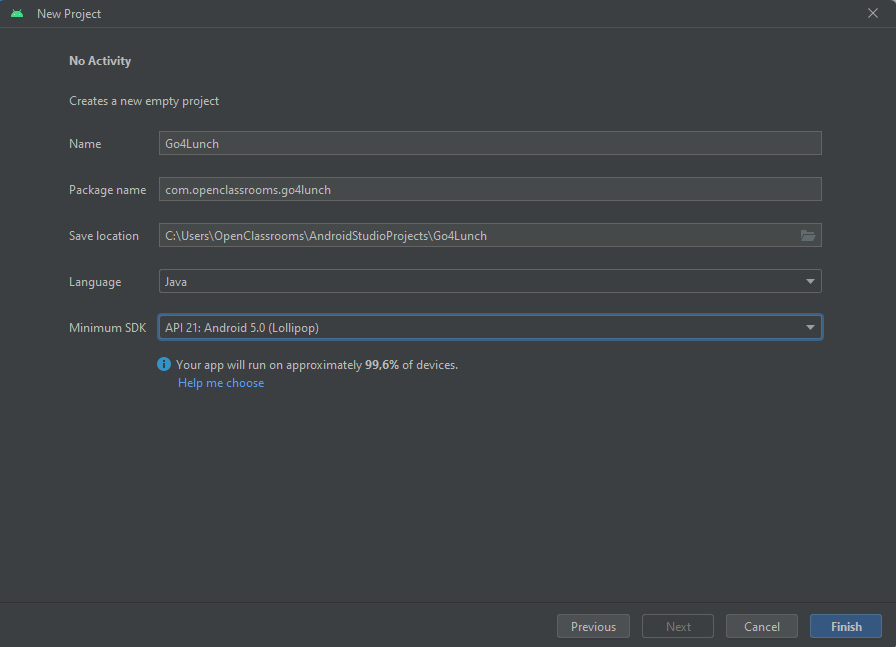
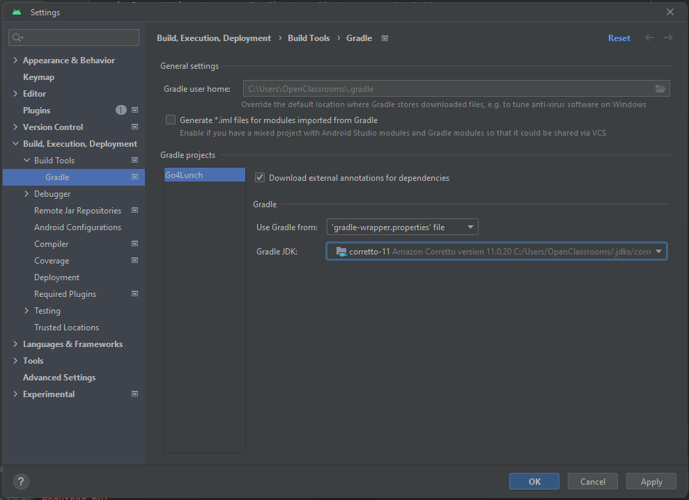

# Documentation

0. Prerequisites :

- [Android Studio Flamingo](https://redirector.gvt1.com/edgedl/android/studio/install/2022.2.1.20/android-studio-2022.2.1.20-windows.exe) | 2022.2.1 Patch 2 (see Help > About)

1. Setup [Amazon Correto 11](https://corretto.aws/downloads/latest/amazon-corretto-11-x64-windows-jdk.msi)

2. Create a new project, as this image :

3. Change Gradle Java version to Correto 11 :

4. check the following files perfectly match :

- build.gradle (project and app)
- gradle.properties
- settings.gradle

5. Add your google-services.json (from Firestore) in the app directory (with your file explorer)

5. Do gradle sync

6. Copy/path the Java sources

7. Run the application
